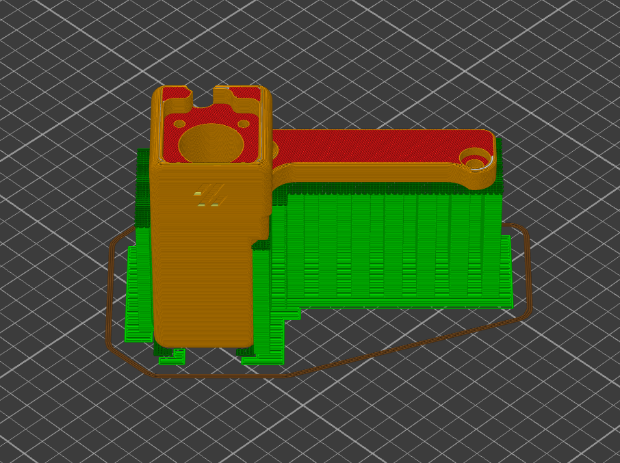
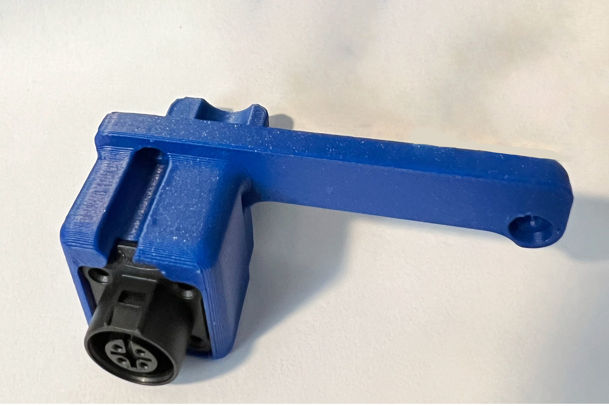

# Voron V2 A-Drive Rear Umbilical Mount for CNLinko LP12 connector

CAN Bus / Real Umbilical mount for a Voron V2.4 A-Drive that is compatible with
a [LP12 Aviation Connector](https://www.amazon.com/dp/B087MF2LQ1/).

## Summary

The umbilical mount is based on [Minsekt's Rear Umbilical
Addon](https://github.com/VoronDesign/VoronUsers/tree/master/printer_mods/Minsekt/Rear_Umbilical)
and changes it to work with the LP12 connector type that is easier to get in the
US.

## Assembly

To install the connector 4x M2x10 Self-Tapping FHCS screws are required as the
clearance of the plug on the back side doesn't allow most socket head M2x10
screws. In a pinch, it seems to work fine with just 2 M2x10 SHSC in the holes
facing into the cabin.

## Printing

Use the Voron default settings, but print **with** supports.

## Images

## License

This remix is - identical to the original work - licensed under the GNU General
Public License v3.0, for more details check the [LICENSE](./LICENSE).
