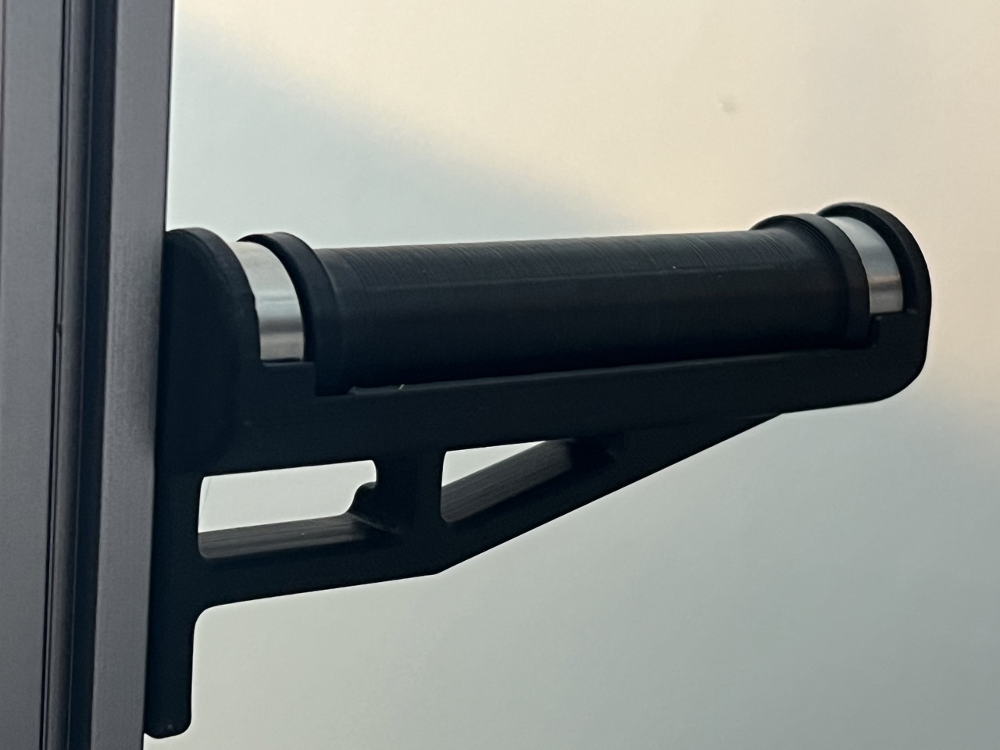

# Roller spool holder with friction control

Three sizes of roller spool holders with friction control for mounting to 2020 extrusions.

## Summary

Roller spool holder with friction control in multiple sizes

This design is a remix of the [Voron 2.4 spool holder with friction control](https://www.thingiverse.com/thing:5424091) by deathrow360 to make it printable without supports. The bearing shafts are designed for press fit and require a well-calibrated printer. If they are too loose a drop of super glue will fix it. If they are too tight use some sandpaper to make them fit.

Or use your Slicer X/Y compensation to make them fit better.

## Design

- Bearings provide smooth rolling for good print quality, and little pulling is required by the extruder.
- Friction can be increased to prevent unspooling due to too little friction with an M4 screw
- Made to fit 2020 Extrusions with panels, tested on Voron 2.4 and Voron Trident printers, both side and back mounted.

To complete the spool holder you'll need two 608ZZ bearings and optionally an M4x6mm screw for friction control.

## Printing

Select the desired width (75mm should fit most common 1kg spools) and print one each of the cage and the drum and two bearing shafts

### Print Settings

All parts should be oriented correctly to print without supports. These are the recommended settings (the drums should be printable with 0-10% infill if so desired).

- Layer height: 0.2mm.
- Extrusion width: 0.4mm, forced.
- Infill percentage: 40%
- Infill type: grid, gyroid, honeycomb, triangle, or cubic.
- Wall count: 4
- Solid top/bottom layers: 5
- Supports: **NONE**

## Assembly

Mount the cage to your frame using an M5 bolt and a T-Nut
Press bearing shafts into the drum. The chamfered side of the shaft is meant to go into the drum and ensure the shaft is straight and acts as a stop as well. You should have about 1mm of the wider part of the shaft visible when it's fully inserted into the roll.
Add the 608 bearings onto the shafts
Insert the assembled roller drum into the mounted cage.

## Images

## Model origin

[Voron 2.4 spool holder with friction control](https://www.thingiverse.com/thing:5424091) by deathrow360 on Thingiverse

## License

This work is licensed under a [Creative Commons Attribution 4.0 International License](https://creativecommons.org/licenses/by/4.0/).
