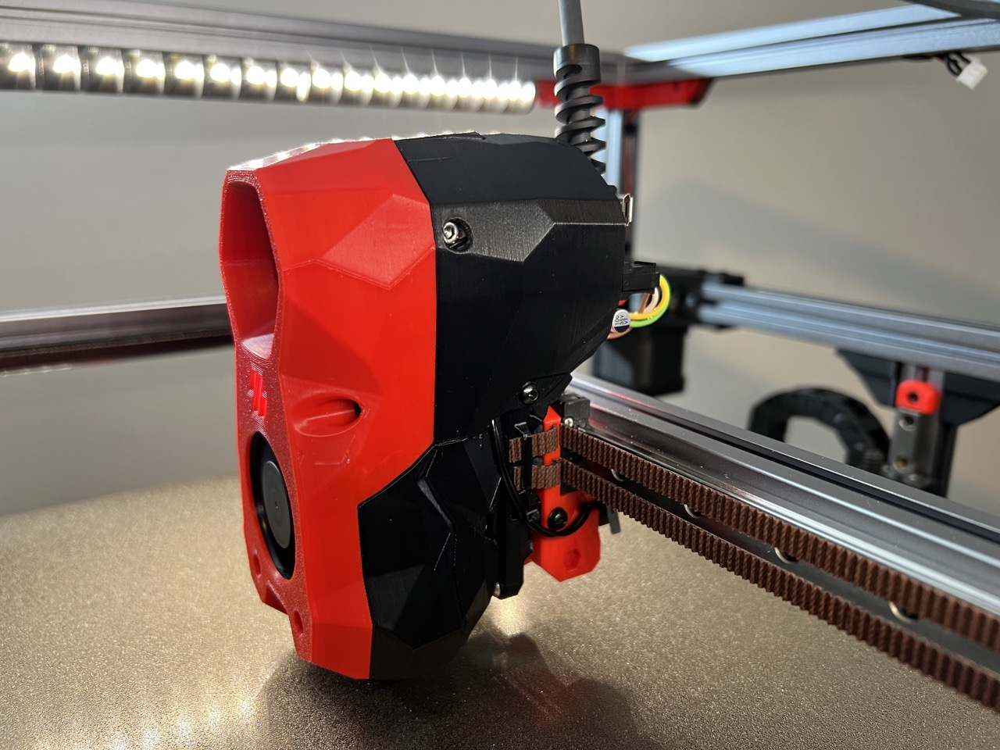

# Orbiter 2.0 Stealthburner mount with CW2 PCB Shroud & Umbilical

These remixed STL files combine to built at Voron Stealthburner Toolhead with
the following features:

- Orbiter 2.0 Extruder mount (CW2 style), compatible with the the Stealthburner
  X-Carriage as well as the Tap carriage
- Clockwork 2 style PCB Shroud for a nice, clean enclosed look
- Toolhead PCB mount
- Chain anchor for PG7 cable gland

## Summary

This is a remix / combination of work done by elcrni/LayerGuru for the original
Orbiter 2.0 Stealthburner mod and incorporates changes from @sshantt#7089
published on the Voron Discord server.[#voronuser_mods Discord channel](https://discord.com/channels/460117602945990666/635687829254701107/1033631861727047710).

The PCB mount has been modified to work with the [Fysetc SB CAN](https://wiki.fysetc.com/SB%20CAN%20ToolHead/) Toolhead PCB to increase clearane between the Orbiter 2.0
Thumbscrew and the connectors on the PCB.

## References

These links go to the sources of the mods, for GitHub repositories to the
actual revisions that were used:

- [Stealthburner mount with CW2 shroud mod](https://github.com/elcrni/Voron-Mods/tree/910ad00e7e7482fb473ec044a8a21da57a2adc3c/Orbiter_2.0_SB_CW2_Enclosed)
- sshant's [Orbiter 2.0 PCB Mod](https://discord.com/channels/460117602945990666/635687829254701107/1033631861727047710)

## Assembly

Please use the [BOM / Images](https://github.com/elcrni/Voron-Mods/blob/910ad00e7e7482fb473ec044a8a21da57a2adc3c/Orbiter_2.0_SB_CW2_Enclosed/README.md)
in the upstream repository as guidance. Additional heat inserts are needed for
the PCB mount.

When installing the PCB nylon washer have been used (instead of the normal
Stealthburner PCB Spacer) to increase the clearane between the cable cover and
the connectors.

## Images

## License

This work is licensed under the GNU General Public License v3.0.
