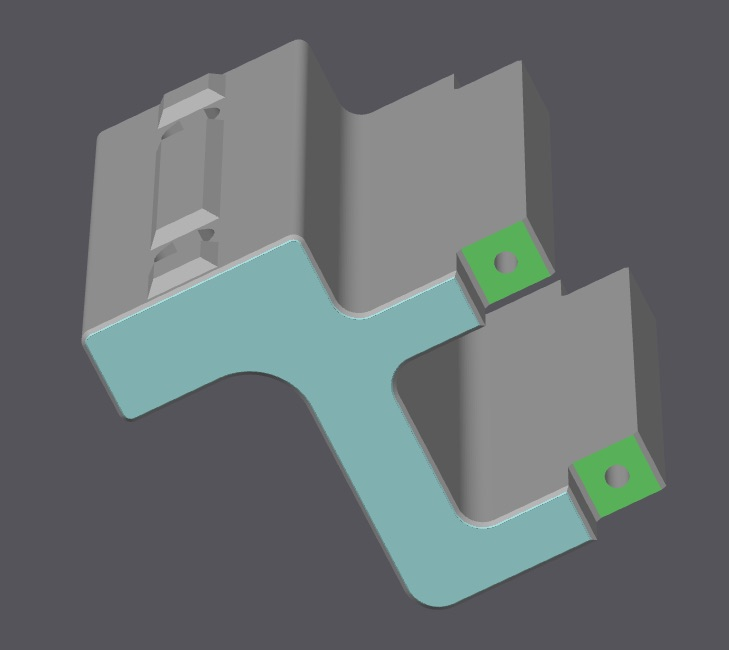
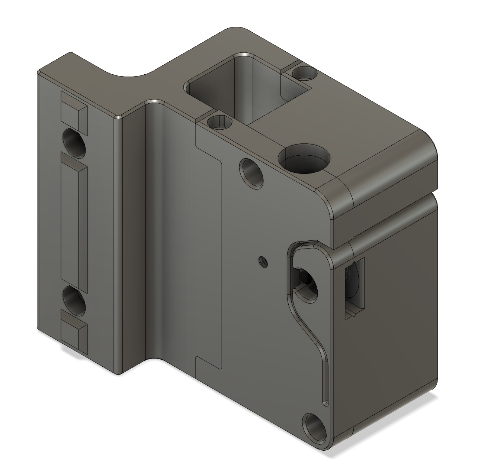

# Trident Internal Filament Sensor

TCRT5000 based filament motion sensor designed to work with the [Trident Internal Spool Holder](https://github.com/elcrni/Voron-Mods/tree/main/Trident_Internal_Spool_Holder) mod.

## Summary

Based on the designs from [Tircown](https://github.com/Tircown/VoronFrenchUsers/tree/main/Mod/Filament_motion_sensor) and [rongith](https://github.com/rongith/Adaptation-from-Tircown-s-filament-sensor/) this is a frame holder and a modified housing for the sensor to mount inline with the PTFE tube guides for the internal spool holder.

### Print Settings

All parts should be oriented correctly to print, the frame mount needs minimal supports, check the images below for details.

- Layer height: 0.2mm.
- Extrusion width: 0.4mm, forced.
- Infill percentage: 40%
- Infill type: grid, gyroid, honeycomb, triangle, or cubic.
- Wall count: 4
- Solid top/bottom layers: 5

### Supports

## BOM

- 1x TCRT5000 -  PCB with the slightly offset screw hole :: [Amazon](https://www.amazon.com/gp/product/B0BZVKJF4)
- 1x 623ZZ Bearing :: [Amazon](https://www.amazon.com/gp/product/B07FW257LJ) | [AliExpress](https://www.aliexpress.us/item/2251832628882337.html)
- 1x BMG Extruder Gear :: [Amazon](https://www.amazon.com/dp/B09JJQLJB9/) | [AliExpress](https://www.aliexpress.us/item/2255800969967302.html)
- 2x ECAS04 Fitting :: [Amazon](https://www.amazon.com/gp/product/B099NPWSFB/) | [AliExpress](https://www.aliexpress.us/item/2251832747833403.html)
- 2x M3x20 SHCS
- 1x M3x12 SHCS
- 1x M3x8 SHCS
- 4x M2x8 SHCS self-tapping
- 2x M5x8 SHCS
- 2x M5 Roll-in T-Nut
- 2x M3x5+x4 threaded insert

## Assembly

1. Install the threaded inserts into the left sensor housing.
2. Install the bearing with a M3x12 by self-tapping into the right sensor housing.
3. Grease the needle bearings, install them into the dual-gear, and place everything on the shaft.
4. Insert the dual-gear assembly into the right sensor housing.
5. Assemble the two sensor housing halves with the M3x20.
6. Install the two ECAS fittings.
7. Install the TCRT5000 module with the M3x8 by self-tapping.
8. Join the assembled sensor houing and the frame mount using the M2x8 self-tapping screws.
9. Install the filament sensor into the PTFE path at a height that still allows the spool to spin. It can replace one of the original PTFE guides.

## Images

## License

This work is licensed under the GNU General Public License v3.0.
