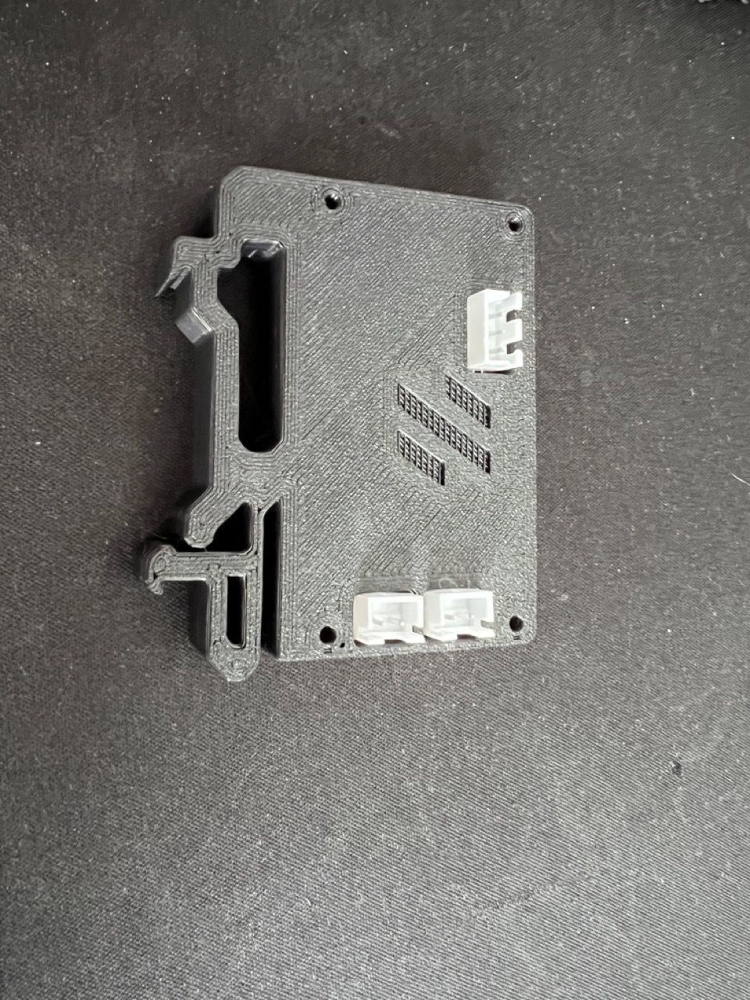
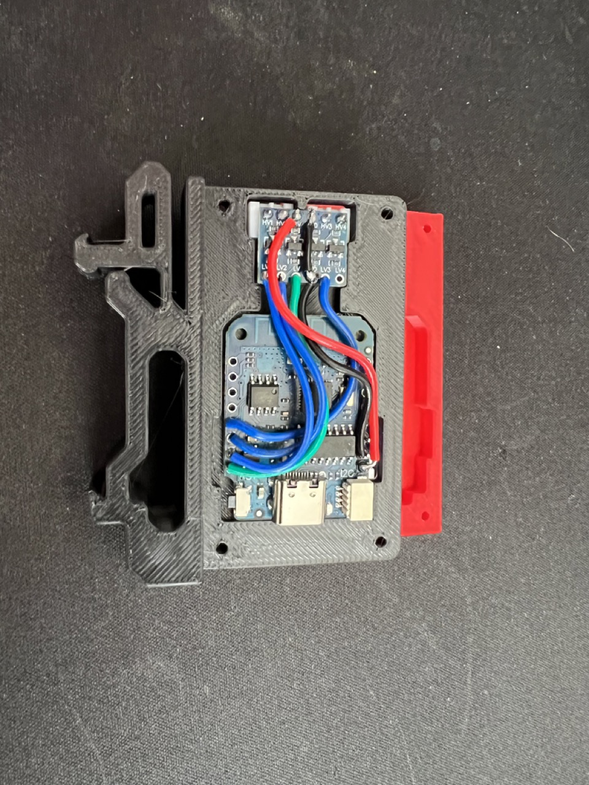
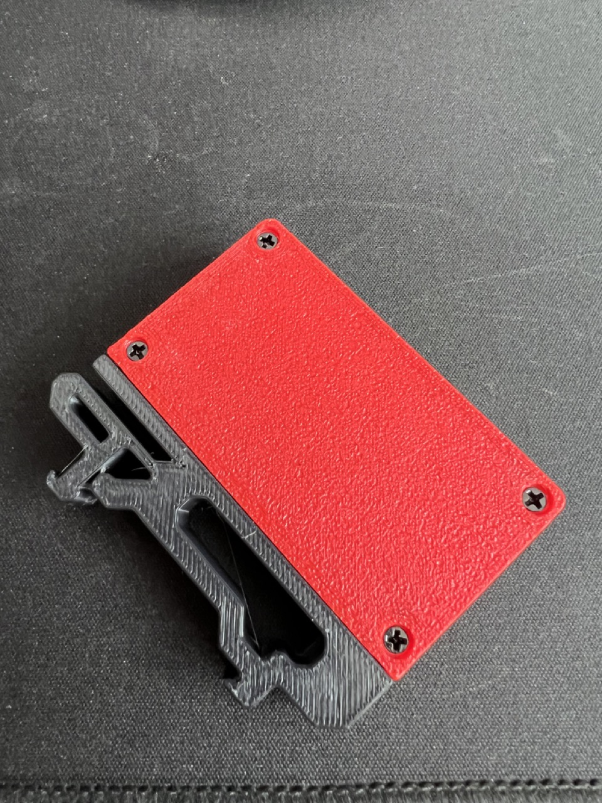

# WEMOS D1 Mini 4.0 DIN Rail Mount

A DIN Rail mount for a WEMOS D1 Mini 4.0 that includes a mount for a 4-channel level shifter to properly drive Neopixel LED strips.

## Summary

DIN Rail mount for a [WLED](https://kno.wled.ge/) controller based on a WEMOS D1 Mini 4.0. Provides 3 5V LED channels (max for WLED on ESP8266 hardware) and two additional GPIO pins for additional use cases like buttons.

This design is a remix of the [Voron WEMOS D1 Mini Din Rail clip](https://github.com/hartk1213/MISC/tree/main/Voron%20Mods/Non%20Printer%20Voron%20Stuff/Voron_WEMOS) by hartk that adapts it to the D1 Mini 4.0 and the level-shifted outputs for WLED.

## Design

- 4x GPIO output pins level shifted to 5V. Three of these are usable with WLED to drive addressable LED strips.
- 1x GPIO pin that can be used as input/output, for example for a button to toggle the chamber lights.

## Hardware

- 1x [WEMOS D1 Mini 4.0](https://www.aliexpress.us/item/3256804340898528.html)
- 1x [4 channel 3.3V to 5V logic level converter](https://www.amazon.com/gp/product/B07LG646VS)
- 1x 3-pin JST-XH connector, female
- 2x 2-pin JST-XH connector, male
- 4x M2x10 self-tapping screw

### Print Settings

All parts should be oriented correctly to print without supports.

- Layer height: 0.2mm.
- Extrusion width: 0.4mm, forced.
- Infill percentage: 40%
- Infill type: grid, gyroid, honeycomb, triangle, or cubic.
- Wall count: 4
- Solid top/bottom layers: 5
- Supports: **NONE**

## Assembly

1. Solder the 3-pin JST-XH connector on the back of the board (opposite the USB connector) to pins VBUS, GND and GPIO2. Check orientation, they only fit one way.
2. Solder the 2-pin JST-XH connectors to HV1/2 and HV3/4 of the level shifter. Check orientation, they only fit one way.
3. Wire up the D1 Mini and the logic converter. **Avoid the GPIO15 pin, using it prevents the D1 from booting.
4. Put on the lid and secure it with the 4 M2 screws.

## Images

## Model origin

[Voron WEMOS D1 Mini Din Rail clip](https://github.com/hartk1213/MISC/tree/main/Voron%20Mods/Non%20Printer%20Voron%20Stuff/Voron_WEMOS) by hartk

## License

This work is licensed under the GNU General Public License v3.0, for more details check the [LICENSE](./LICENSE).
